# Architecture

## Signal flow

```mermaid
flowchart LR
    IN[Input] --> HPF[Tight<br/>HPF, 20-300 Hz]
    HPF --> BRIGHT[Bright<br/>fixed high-shelf switch]
    BRIGHT --> GAIN[Gain<br/>0-40 dB]
    GAIN --> UP[8x Oversample]
    UP --> S1[Cascade stage 1<br/>gain -> asym clip -> HP/LP]
    S1 --> S2[Cascade stage 2<br/>gain -> asym clip -> HP/LP]
    S2 --> S3[Cascade stage 3<br/>gain -> asym clip -> HP/LP]
    S3 --> DOWN[8x Downsample]
    DOWN --> BASS[Bass<br/>low shelf, 150 Hz]
    BASS --> MID[Mid<br/>peak, 650 Hz]
    MID --> TREBLE[Treble<br/>high shelf, 3.5 kHz]
    TREBLE --> LEVEL[Level<br/>output trim]
    LEVEL --> MIX[Dry/Wet Mix]
    IN -.->|delay-compensated dry path| MIX
    MIX --> OUT[Output]
```

Everything from the Tight HPF through Level is the "wet" path, owned by `TenebraeEngine` (`src/dsp/TenebraeEngine.{h,cpp}`). The dry path is the untouched input signal, delayed to stay time-aligned with the wet path (see [Latency and oversampling](#latency-and-oversampling) below), then blended in at the Mix stage via `juce::dsp::DryWetMixer`.

Two M1 additions sit outside this linear diagram since they are discrete switches rather than points in the signal chain: **Voicing** (Tight/Loose) selects which of two preallocated, independently-prepared sets of the three cascade stages actually runs each block (see [The waveshaper cascade](#the-waveshaper-cascade)), and **Tone Voice** (Flat/Scoop/Boost) adds a fixed dB tilt on top of the live Bass/Mid/Treble values before they reach the tone stack's filter coefficients (see [Parameter smoothing](#parameter-smoothing)).

## Module map

| Directory | Responsibility |
|---|---|
| `src/dsp` | All audio-thread DSP: `AsymmetricClipper` (the stateless tanh nonlinearity), `CascadeStage` (one gain -> clip -> fixed interstage HP/LP unit), `ToneStack` (Bass/Mid/Treble shelving+peak bands, plus the Tone Voice tilt), and `TenebraeEngine` (the full signal chain wiring them together with the Tight HPF, Bright switch, pre-gain, 8x oversampling, Voicing-selected cascade, Level, and dry/wet mix). No allocation, locks, or I/O once `prepare()` has run. Independent of `juce::AudioProcessor`, so it is directly unit-testable (see `tests/EngineTests.cpp`, `tests/AsymmetricClipperTests.cpp`, `tests/ToneStackTests.cpp`). |
| `src/params` | Parameter layout and `AudioProcessorValueTreeState` definitions - parameter IDs, ranges, defaults. Single source of truth for what a preset captures. |
| `src/PluginProcessor.*` | Host plumbing: APVTS construction, `prepareToPlay`/`processBlock`/`reset`, latency reporting, state save/load. Reads APVTS values and pushes them into `TenebraeEngine` every block; does not implement any DSP itself. |
| `src/PluginEditor.*` | A simple, functional v0.1 GUI: one rotary slider per continuous parameter (`SliderAttachment`), a combo box per choice parameter (`ComboBoxAttachment`, Voicing/Tone Voice), and a toggle button for Bright (`ButtonAttachment`). A custom vector-drawn GUI is a later milestone. |

Dependency direction is one-way: `PluginEditor` -> `params` (via attachments) and `PluginProcessor` -> `params` + `dsp`. `src/dsp` has no upward dependency on the processor or UI, which is what keeps `TenebraeEngine` (and its constituent `CascadeStage`/`ToneStack` units) testable in isolation.

## The waveshaper cascade

`TenebraeEngine` drives three `CascadeStage` instances in series, each `gain -> AsymmetricClipper::processSample -> fixed interstage HP/LP filter pair`. Only the single pre-cascade **Gain** parameter is user-automatable; each stage's own internal drive, clipping asymmetry, and interstage filter corners are fixed voicing constants (set in `TenebraeEngine`'s constructor and `prepare()`). As of M1, the engine keeps **two** complete triplets of `CascadeStage` prepared at all times, selected by the **Voicing** parameter:

**Tight** (default, the original v0.1 cascade):

| Stage | Drive (fixed) | Asymmetry | Interstage HP | Interstage LP |
|---|---|---|---|---|
| 1 | 6 dB | 0.15 | 80 Hz | 9000 Hz |
| 2 | 8 dB | 0.25 | 120 Hz | 6500 Hz |
| 3 | 10 dB | 0.35 | 150 Hz | 5000 Hz |

**Loose** (M1 addition, a softer-driven, wider-band alternative):

| Stage | Drive (fixed) | Asymmetry | Interstage HP | Interstage LP |
|---|---|---|---|---|
| 1 | 4 dB | 0.10 | 60 Hz | 10000 Hz |
| 2 | 6 dB | 0.18 | 90 Hz | 8000 Hz |
| 3 | 8 dB | 0.25 | 110 Hz | 6500 Hz |

Within either voicing, each stage is driven a little harder, clips a little more asymmetrically, and is filtered a little tighter/darker than the last, so the cascade converges onto a focused "chug" band rather than piling up an ever-fizzier, ever-boomier mess as gain stacks. This is the same rationale `CascadeStage.h` documents at the single-stage level, concretised here with actual numbers. Loose applies the same idea with a gentler slope throughout (lower drive, less asymmetry, looser interstage corners), for a more vintage-leaning character rather than simply "less gain".

Both triplets are prepared in every `TenebraeEngine::prepare()` call and reset in every `reset()` call, so `TenebraeEngine::setVoicing()` is a cheap branch in `process()` (which triplet actually runs), never a reallocation - real-time-safe to call every block, same as any other parameter setter.

## Latency and oversampling

The three cascade stages run inside an 8x oversampled block (`juce::dsp::Oversampling<float>`, half-band polyphase IIR, `useIntegerLatency = true`). Three cascaded nonlinearities generate substantially more high-frequency content than a single clipper, so 8x (vs. e.g. 4x for a single-stage boost/OD) keeps aliasing generated by every stage - not just the first - out of the audible band.

This oversampling is the only source of the plugin's reported latency: `TenebraeEngine::getLatencySamples()` returns `oversampler.getLatencyInSamples()` (an exact integer, since `useIntegerLatency` is enabled), and `TenebraeAudioProcessor::prepareToPlay()` reports it to the host via `setLatencySamples()`, so host-side plugin delay compensation (PDC) accounts for the whole chain.

The dry path used by the Mix control has to stay time-aligned with this delayed wet path. Rather than a hand-rolled delay line, `TenebraeEngine` uses `juce::dsp::DryWetMixer`: the pre-processing signal is captured via `pushDrySamples()` before any wet-path filtering touches the buffer, and `setWetLatency(getLatencySamples())` configures the mixer's internal delay line to match. `mixWetSamples()` then blends the two back together, so at Mix = 0% the output is a sample-accurate passthrough of the input, once shifted by `getLatencySamples()` (this is exactly what `tests/EngineTests.cpp`'s null test verifies, to < -90 dBFS residual).

One JUCE 8.0.14 behaviour worth calling out because it cost real debugging time on a sibling plugin (see `tests/DryWetMixerContractTests.cpp`): `DryWetMixer`'s internal dry/wet gain smoothers default their *target* to fully wet (`mix == 1.0`) until `setWetMixProportion()` is called, and the mixer's own `reset()` (invoked from its `prepare()`) only snaps the smoothers' *current* value to whatever *target* is set at that moment - it has no idea what the "real" starting Mix parameter value should be. Skipping this would mean a freshly prepared engine audibly ramps in from 100% wet over the mixer's internal ~50ms default ramp on every `prepareToPlay()`, regardless of the actual Mix parameter. `TenebraeEngine::prepare()` works around this by calling `dryWetMixer.setWetMixProportion(lastMixProportion)` *before* its own `reset()` runs, so the mixer is already sitting at the correct dry/wet balance from the very first `process()` call.

The Tight HPF, the M1 Bright shelf, and the ToneStack's Bass/Mid/Treble bands are plain 2nd-order IIR filters (`juce::dsp::IIR::Coefficients::makeHighPass`/`makeHighShelf`/`makeLowShelf`/`makePeakFilter`) running at the host rate, outside the oversampled block - they add no new nonlinearity, so no extra anti-aliasing headroom is needed for them, and their own small, frequency-dependent group delay is treated as ordinary filter character rather than something to compensate.

**Bright** applies a fixed high-shelf (+5 dB @ 3.5 kHz, the same corner frequency as the Treble band, so they stack rather than fight over the same range) after Tight and before Gain - i.e. before the cascade's nonlinearity, not after it, so engaging Bright changes what feeds the clipper rather than just re-EQing an already-clipped signal. `TenebraeEngine::setBright()` recomputes the shelf's coefficients only on an actual state change (comparing against the last-known `brightEnabled`), avoiding redundant trig calls on every block for a control that is typically left alone for long stretches.

**Tone Voice** (Flat/Scoop/Boost) does not touch any filter directly; it stores a fixed `(bassTiltDb, midTiltDb, trebleTiltDb)` triple in `ToneStack`, added to each band's already-smoothed dB value inside `ToneStack::updateCoefficients()` before the combined total (clamped to +/-21 dB) is handed to `makeLowShelf`/`makePeakFilter`/`makeHighShelf`. This means the individual Bass/Mid/Treble knobs stay fully live and independently automatable on top of whichever Tone Voice is selected, rather than Tone Voice overriding them.

Both Bright and Voicing are discrete switches (like a physical amp channel-select or bright-cap switch), so - unlike Tight/Gain/Bass/Mid/Treble/Mix - they are deliberately **not** smoothed: engaging them can produce a small audible step rather than a crossfade. This is a conscious trade-off documented at each call site (`TenebraeEngine::setBright()`, `TenebraeEngine::setVoicing()`), not an oversight.

## Parameter smoothing

- **Gain** and **Level** are plain gain stages (`juce::dsp::Gain<float>`), which ramp sample-accurately via their own internal `SmoothedValue` (`setRampDurationSeconds`). Each `CascadeStage`'s fixed internal drive uses the same mechanism.
- **Tight** is a filter cutoff frequency. Recomputing IIR coefficients involves trig calls, so it is not cheap to interpolate per sample; instead it is smoothed with a `juce::SmoothedValue<float, ValueSmoothingTypes::Multiplicative>` (multiplicative smoothing suits frequencies, which are perceived logarithmically) and the filter coefficients are recomputed once per block from the smoothed value.
- **Bass/Mid/Treble** use linear `SmoothedValue`s on the dB values themselves (`ToneStack`), re-applied to their respective filter coefficients once per block via `updateCoefficients()` (which also folds in the Tone Voice tilt - see above).
- **Mix** is smoothed both by the engine's own `juce::SmoothedValue<float, ValueSmoothingTypes::Linear>` (feeding `DryWetMixer::setWetMixProportion()` once per block) and by `DryWetMixer`'s own internal ~50ms ramp on top of that.
- **Voicing**, **Bright**, and **Tone Voice** are discrete switches and are intentionally not smoothed (see above).
- All continuous-control smoothers are seeded to their real starting value in `TenebraeEngine::prepare()` (see `lastTightHz`/`lastGainDb`/`lastLevelDb`/`lastMixProportion`), so re-preparing (sample-rate change, etc.) never resets a live parameter back to a built-in default or lets a smoother ramp from an invalid 0 Hz/0.0 starting point. `lastLevelDb` is an M1 addition: `juce::dsp::Gain`'s internal `SmoothedValue` default-constructs to *linear zero* (silence), not unity, so `outputLevel` - like `preGain` already did via `lastGainDb` - must be explicitly re-primed on every `prepare()`, or any prepare() call not immediately preceded by a fresh `setLevelDb()` call would produce a permanently silent wet path (see the M1 fix note in `TenebraeEngine.cpp`).

## Real-time safety

- `TenebraeAudioProcessor::processBlock()` starts with `juce::ScopedNoDenormals`.
- All DSP state (filters, the oversampler, the cascade stages, the dry/wet delay line) is allocated in `prepare()`/`prepareToPlay()` and never reallocated on the audio thread.
- `reset()` clears all filter/oversampler/cascade/delay-line state without deallocating (`TenebraeEngine::reset()`, called from both `AudioProcessor::reset()` and internally from `prepare()`).
- Parameter values are read via `apvts.getRawParameterValue()` atomics in `processBlock()`, never via `apvts.getParameter()->getValue()` (which is not guaranteed lock/allocation-free) and never via `String`-keyed lookups on the audio thread.
- `TenebraeEngine::process()` treats a zero-sample block as a safe no-op before touching any filter/oversampler/cascade state.
- Filter cutoff frequencies passed to `IIR::Coefficients::makeHighPass`/`makeLowPass` are clamped below Nyquist (`clampBelowNyquist`, in `TenebraeEngine.cpp` and `CascadeStage.cpp`) as defensive insurance against invalid coefficients if the plugin is ever prepared at an unusually low sample rate.
- **Voicing** switches between two fully preallocated cascade triplets (both prepared/reset alongside everything else) rather than reconstructing one on demand, so selecting a voicing is a plain integer comparison in `process()` - no allocation, matching the same real-time-safety bar as every other parameter.
